> 시고방마매륜, 미족시야. 제용여일, 정지도야. 강유개득, 지리지야. — 퇴로를 없애는 강압이 아니라 제도와 지형이 서로 다른 사람을 하나의 군대로 만든다.

## 1. 원문·독음·직역·한자어 뜻풀이

是故方馬埋輪, 未足恃也. 齊勇如一, 政之道也. 剛柔皆得, 地之理也. 시고방마매륜, 미족시야. 제용여일, 정지도야. 강유개득, 지리지야.

	**직역** 그러므로 말을 나란히 묶고 수레바퀴를 묻는 것만으로는 충분히 믿을 수 없다. 용기를 가지런히 하여 하나처럼 만드는 것은 정치와 통솔의 길이다. 강한 자와 유약한 자가 모두 제 몫을 얻게 하는 것은 지형의 이치다.

#### 方馬埋輪(방마매륜) — 도망칠 도구를 없앤다고 마음까지 하나가 되지는 않는다
`方`은 나란히 묶는다는 뜻이고, `馬`는 퇴각과 기동의 수단입니다. `埋`는 땅속에 묻는 행위이며 `輪`은 수레바퀴입니다. 말과 수레를 못 쓰게 하면 병사는 당장 달아나기 어렵지만, 명령을 신뢰하고 서로 돕게 되는 것은 아닙니다.

#### 齊勇如一(제용여일) — 개인의 담력을 같은 방향으로 정렬하다
`齊`는 가지런할 제, `勇`은 용기 용입니다. 모든 사람이 똑같이 대담해지라는 말이 아니라, 겁이 많거나 대담한 차이가 있어도 정해진 시간과 위치에서 같은 행동을 하게 만드는 것입니다. 반복 훈련, 명확한 신호, 예비대와 상벌이 개인차를 공동 행동으로 바꿉니다.

#### 政之道(정지도) — 용기는 지휘와 제도의 산물이다
`政`은 바르게 정돈하는 통치와 군정입니다. 장수가 위험 밖에서 희생만 요구하면 공포는 분노와 이탈로 바뀝니다. 임무·권한·구원 계획·보급이 분명할 때 병사는 옆 부대가 자기 역할을 할 것이라 예상할 수 있습니다.

#### 剛柔皆得(강유개득) — 강한 자와 약한 자 모두 쓸 자리가 있다
`剛`은 강함, `柔`는 유연함, `皆得`은 모두가 알맞은 쓰임을 얻는다는 뜻입니다. 돌격에 강한 기병, 버티는 보병, 멀리 보는 정찰병, 운반과 치료를 맡는 인원은 같은 능력을 갖지 않습니다. 좋은 지휘는 차이를 없애지 않고 결합합니다.

#### 地之理(지리지) — 땅은 약점을 숨기고 강점을 연결하는 편제다
`地`는 단순한 배경이 아니라 거리·경사·하천·마을·통로입니다. 좁은 전면은 열세 병력을 보호하고, 낮은 구릉은 기동을 숨기며, 습지와 목책은 빠른 적을 느리게 합니다. 지형을 얻는다는 말은 강자만 앞세우는 것이 아니라 서로 다른 병종이 제 역할을 할 조건을 만드는 일입니다.

#### 글자들이 완성하는 한 장면
겁이 없는 사람만 모아 퇴로를 끊는 군대는 한 번의 충격에 무너질 수 있습니다. 반대로 지휘관이 누가 어디서 무엇을 하고 실패하면 누가 메울지 정하고, 지형이 그 연결을 보호하게 하면 강한 사람과 약한 사람이 함께 움직입니다. 손자는 용기를 감정이 아니라 **조직이 재현할 수 있는 행동**으로 바꿉니다.

---

## 2. 전통 주석 기반 분석 {toggle="true" color="blue_bg"}
	- **조조(曹操)** — "**말과 수레를 버리게 하는 형벌만 믿지 말라.** 병사가 한마음으로 나아가는 까닭은 법령과 지휘가 먼저 정돈되었기 때문이다."
	- **이전(李筌)** — "**강함만 세우면 부러지고 유약함만 따르면 흩어진다.** 땅의 형세에 맞춰 강유가 서로 쓰이게 해야 한다."
	- **두목(杜牧)** — "**옛 전투에서 퇴로를 끊고도 패한 군대는 많았다.** 상하의 신뢰와 편제가 없는 결사는 잠깐의 분노일 뿐이다."
	- **매요신(梅堯臣)** — "`足恃`라는 말에 주의하라. **기댈 만한 것은 물건을 묻는 행위가 아니라 사람을 가지런히 하는 정치다.**"
	- **장예(張預)** — "**정(政)은 부대를 하나로 묶고, 지(地)는 병종을 알맞은 자리에 둔다.** 두 조건이 갖춰져야 강유가 모두 쓰인다."
	- **왕석(王晳)** — "퇴로 차단은 선택지를 줄일 뿐 협력을 만들지 않는다. **협력은 서로의 행동을 예측할 수 있는 명령 체계에서 나온다.**"
	- **가림(賈林)** — "**담대한 자는 선봉에, 신중한 자는 지키는 곳에 두라.** 모든 사람에게 같은 용맹을 요구하면 오히려 쓸 사람을 잃는다."
	- **두우(杜佑)** — "**상벌·군량·부대 편제와 신호 체계가 군정의 실체다.** 제도가 비어 있으면 사지에 던진 군대도 서로를 버린다."
	- **진호(陳皞)** — "**정치가 마음을 합치고 지형이 힘을 배치한다.** 이 둘이 함께할 때 많은 병사가 한 사람의 수족처럼 움직인다."

---

## 3. 교차 설명 {toggle="true" color="green_bg"}
	### ① 손자병법 안의 연결
	앞 구절의 오월동주는 공동 위험이 적대자를 협력자로 바꿀 수 있음을 보였습니다. 이번 구절은 그 협력이 우연한 풍랑에만 기대서는 안 된다고 보완합니다. 공동 위험을 지휘·제도·지형으로 재현해야 군대가 지속적으로 하나가 됩니다.
	「세편」의 `求之於勢, 不責於人`도 같은 방향입니다. 개인에게 초인적 용기를 요구하지 말고, 평범한 사람도 정해진 행동을 하게 만드는 형세를 구해야 합니다. 방마매륜은 사람을 탓하는 장치이고, 정지도와 지지리는 형세를 만드는 장치입니다.
	### ② 클라우제비츠 『전쟁론』
	클라우제비츠의 마찰은 명령이 현장에 도착하는 동안 생기는 지연·공포·오해의 합입니다. 퇴로를 끊는 조치는 마찰을 없애지 못하고 오히려 공황의 비용을 키울 수 있습니다. 숙련된 부대와 명확한 지휘 관계가 작은 실패를 흡수합니다.
	그가 말한 도덕적 힘도 물질과 분리된 정신력이 아닙니다. 레우텐의 프로이센군은 훈련·부대 간격·기병 예비대가 있었기에 위험한 사선기동을 수행했습니다. 용기는 조직적 기억이 실제 상황에서 작동한 결과였습니다.
	### ③ 미야모토 무사시 『오륜서』
	무사시는 큰 병법과 한 사람의 병법이 같은 원리로 움직인다고 봅니다. 손과 발이 서로 경쟁하지 않고 상황에 따라 역할을 바꾸듯, 군대도 강한 부대와 유연한 부대를 같은 리듬으로 이어야 합니다.
	「수의 권」은 고정된 한 형식을 고집하지 말라고 합니다. 나가시노에서 조총만을 만능 무기로 읽으면 물의 원리를 놓칩니다. 목책·창병·습지·우회대와 결합했기 때문에 조총수의 약점인 재장전 시간이 보호됐습니다.
	### ④ 오자병법·육도삼략
	『오자병법』은 병사의 사정을 알고 상벌을 분명히 하며 함께 고락을 겪는 지휘를 중시합니다. 죽음을 명령하기 전에 병사가 왜 버텨야 하는지, 옆 부대가 실제로 도울지를 알게 해야 합니다.
	『육도』는 재능에 따라 사람을 나누어 쓰고 각 직책을 맞추는 일을 강조합니다. 강유개득은 모두를 같은 사람으로 만드는 평준화가 아니라, 서로 다른 능력이 빠짐없이 전투 체계에 들어가는 적재적소입니다.
	### ⑤ 현대 심리학·조직행동
	공유된 정신모형 연구는 팀원이 서로의 역할과 다음 행동을 예측할수록 위기 대응이 빨라진다고 설명합니다. 심리적 안전은 나약함이 아니라 오류를 조기에 보고하여 작은 마찰이 대형 사고가 되지 않게 하는 정보 체계입니다.
	Notion의 인물관찰 기록처럼 피로한 현장에서 한 사람이 소리와 압박으로 모두를 움직이려 하면 복명복창과 보고가 끊길 수 있습니다. 강한 조치보다 교대 전 역할 확인, 오류 즉시 보고, 관리자 입회 같은 절차가 서로 다른 성향을 하나의 안전 행동으로 묶습니다.

---

## 4. 역사적 실증 사례 {toggle="true"}
	### 서양 — **프로이센 왕국군** vs **합스부르크 오스트리아군** │ 레우텐 전투(Battle of Leuthen, 1757)
	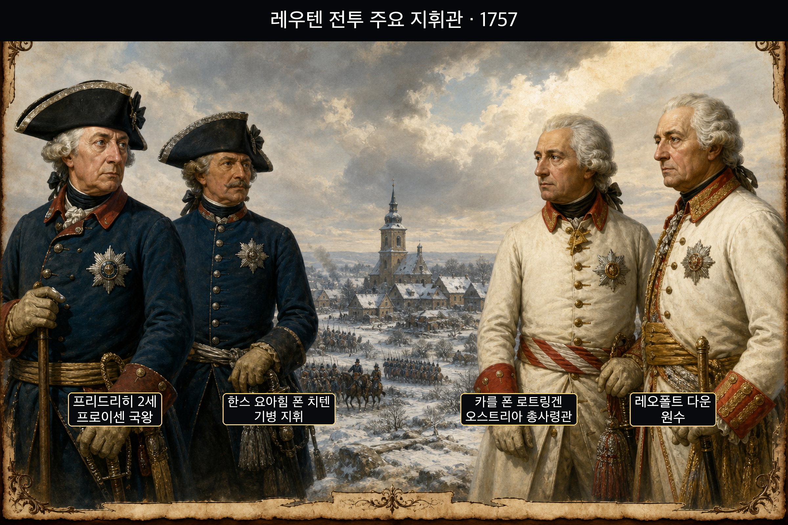
	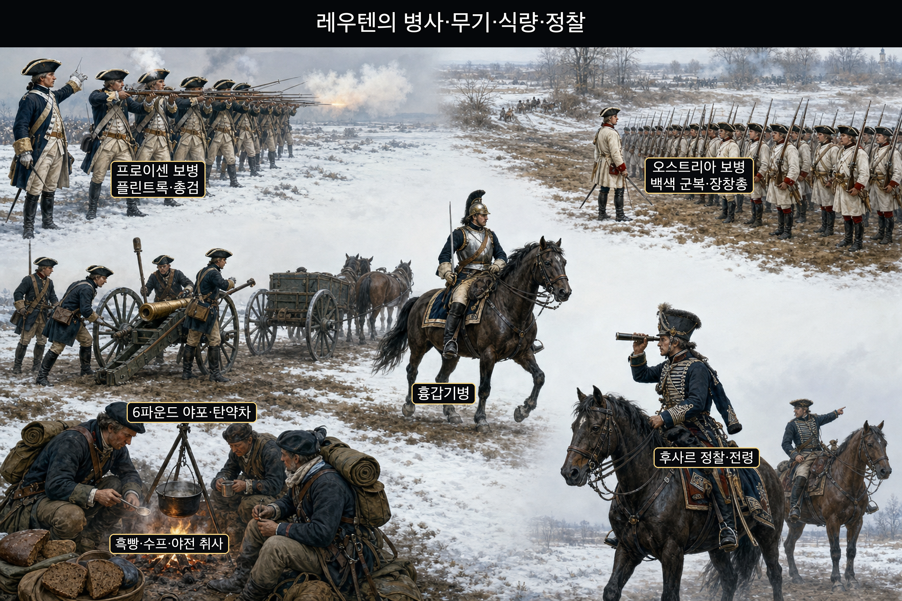
	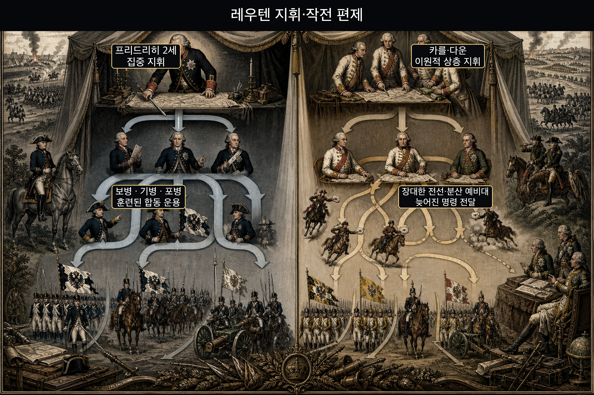
	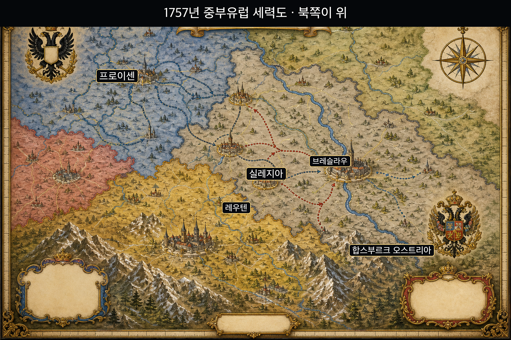
	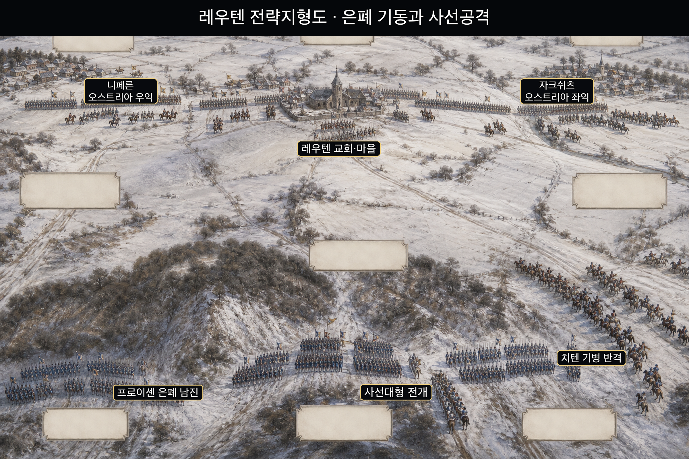
	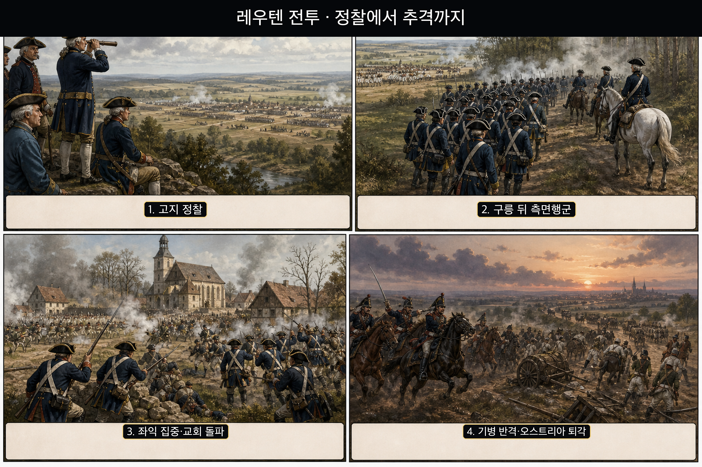
	**뒤에서 반복될 지형을 먼저 잡아두기**
	- ⛰️ 낮은 구릉은 **프로이센군**의 남쪽 측면행군을 가렸다.
	- **▰** **니페른(Nippern)**은 오스트리아 우익으로, 프로이센 선봉의 견제 때문에 주공처럼 보였다.
	- **▰** **자크쉬츠(Sagschütz)**는 오스트리아 좌익으로 실제 집중 공격을 받은 곳이다.
	- **▰** **레우텐(Leuthen)** 교회와 마을은 중앙의 완강한 저항 거점이었다.

	#### 프리드리히가 고지에서 긴 오스트리아 전선을 읽다
	**프리드리히 2세**의 병력은 열세였지만 부대는 반복 훈련으로 사선대형 전환과 빠른 소대사격에 익숙했습니다. **카를 폰 로트링겐**과 **다운**의 군대는 긴 전선에 펼쳐져 각 지점의 병력이 서로 돕는 데 시간이 걸렸습니다.
	#### 니페른의 견제가 주공처럼 보이다
	프로이센 선봉은 오스트리아 우익 앞에서 움직임을 보였습니다. 구릉 뒤에서 본대가 남쪽으로 행군하는 동안 **카를**은 우익을 더 보강했습니다. 보인 움직임은 진짜였지만 공격의 비중과 방향은 달랐습니다.
	#### 사선대형이 자크쉬츠 좌익부터 말아 올리다
	프로이센군은 남쪽에서 방향을 바꿔 오스트리아 좌익에 국지적 우세를 만들었습니다. 각 대대가 차례로 전투에 들어가 앞 부대의 성공을 이어받았고 포병과 보병이 좁은 전면에 화력을 모았습니다.
	#### 레우텐 교회와 치텐의 기병 반격
	오스트리아군은 교회와 마을에서 저항했으나 전선은 이미 한쪽부터 접히고 있었습니다. **치텐**의 기병은 오스트리아 기병을 막고 측후방을 압박했습니다. 퇴로를 묻지 않아도 훈련·지휘·지형이 군대를 하나처럼 움직였습니다.
	#### 패배 회피 분기점 — 좌익을 짧게 접고 예비대를 중앙에 두었다면
	오스트리아 지휘부가 선봉의 견제를 주공으로 단정하지 않고 남쪽 구릉의 정찰을 강화하며 전선을 단축했다면 프로이센의 국지적 우세는 줄었을 것입니다.
	#### 전투에서 사용된 속임수 — 우익 견제 뒤에 숨긴 남쪽 측면행군
	레우텐의 기만은 존재하지 않는 군대를 꾸민 일이 아니라 실제 선봉 행동으로 주공 방향을 오인하게 한 것이었습니다.
	#### 속임수 작동 구조
	**주체와 의도.** **프리드리히**는 오스트리아 예비대를 북쪽에 붙들고 남쪽 좌익에 전력을 집중하려 했습니다.
	**보인 신호와 믿은 이유.** 니페른 앞 선봉 움직임은 이전의 정면전 기대와 맞아떨어졌습니다.
	**유발된 행동과 결과.** 오스트리아 우익이 보강되는 동안 프로이센 본대가 구릉 뒤로 남하해 좌익을 타격했습니다.
	**사료의 경계.** 은폐 측면행군과 견제는 확인되지만 모든 오스트리아 이동이 단 하나의 가짜 공격에 의해 결정됐다고 단순화하지 않습니다.
	#### 속임수 일곱 질문
	1. **누가 누구를 속였는가?** **프로이센 지휘부**가 **오스트리아 지휘부**를 속였습니다.
	2. **어떤 사실이 거짓이었는가?** 북쪽 우익이 주공이라는 인상이 거짓이었습니다.
	3. **어떤 사실은 진실이지만 오해를 유도했는가?** 프로이센 선봉이 실제로 우익 앞에서 움직였지만 본대의 결전 방향은 아니었습니다.
	4. **상대는 왜 그것을 믿고 싶어 했는가?** 정면에서 수적 우세를 쓸 수 있다는 기대를 확인하고 싶었습니다.
	5. **속임수가 없었어도 같은 오판이 발생했을까?** 긴 전선과 느린 정찰 때문에 대응 지연은 있었겠지만 북쪽 보강은 줄었을 것입니다.
	6. **속은 사람은 어떤 독립 확인을 생략했는가?** 남쪽 구릉 뒤 행군을 기병 정찰과 고지 관측으로 충분히 확인하지 못했습니다.
	7. **신뢰·동의·안전을 해치지 않으면서 같은 원리를 어디서 연습할 수 있는가?** 합의된 스포츠·보드게임에서 한쪽 움직임으로 시선을 끌고 다른 공간을 활용하는 연습을 할 수 있습니다.
	#### 시계편 兵者詭道也 — 이 전장에 해당하는 속이는 길
	<table fit-page-width="true" header-row="true">
	<tr><td>해당 구절·독음·뜻</td><td>전장의 장면</td></tr>
	<tr><td>近而示之遠 근이시지원 — 가까이 있으면서 멀리 있는 듯 보인다</td><td>남쪽 본대가 가까운 구릉 뒤에서 행군해 주공 위치를 감췄다.</td></tr>
	<tr><td>用而示之不用 용이시지불용 — 쓰면서 쓰지 않는 듯 보인다</td><td>선봉 견제를 실제 공격처럼 보이게 하면서 본대의 집중은 숨겼다.</td></tr>
	</table>
	#### 法 한눈 비교 — 곡제·관도·주용
	<table fit-page-width="true" header-row="true">
	<tr><td>진영</td><td>곡제</td><td>관도</td><td>주용</td></tr>
	<tr><td>**프로이센군**</td><td>대대·기병·포병을 순차 집중</td><td>국왕 중심 명령</td><td>짧고 빠른 결전</td></tr>
	<tr><td>**오스트리아군**</td><td>긴 전선에 분산</td><td>상층 지휘 이원화</td><td>수적 우세를 넓게 소모</td></tr>
	</table>
	**〈오스트리아군 (패)〉** 긴 전선과 지연된 정찰이 좌익의 고립을 낳았습니다.
	<table fit-page-width="true" header-row="true">
	<tr><td>요소</td><td>판단</td></tr>
	<tr><td color="orange_bg">🤝 **道**</td><td>여러 민족과 지휘부가 좌익 위기를 공동 문제로 전환하지 못했습니다.</td></tr>
	<tr><td color="blue_bg">🌤️ **天**</td><td>겨울의 짧은 낮과 시야가 대응 시간을 줄였습니다.</td></tr>
	<tr><td color="green_bg">🧭 **地**</td><td>구릉 뒤 남진을 놓치고 긴 전선에 묶였습니다.</td></tr>
	<tr><td color="purple_bg">🎖️ **將**</td><td>**카를·다운**의 대응이 뒤늦었습니다.</td></tr>
	<tr><td color="yellow_bg">⚙️ **法**</td><td>분산된 부대와 예비대를 제때 결합하지 못했습니다.</td></tr>
	</table>
	🏳️ **패군 측 결과** 실레지아 주도권을 잃고 브레슬라우 방면으로 후퇴했습니다.
	**〈프로이센군 (승)〉** 훈련과 지형 은폐를 결합해 열세를 국지적 우세로 바꿨습니다.
	<table fit-page-width="true" header-row="true">
	<tr><td>요소</td><td>판단</td></tr>
	<tr><td color="orange_bg">🤝 **道**</td><td>반복 훈련으로 각 대대가 옆 부대의 다음 동작을 예측했습니다.</td></tr>
	<tr><td color="blue_bg">🌤️ **天**</td><td>짧은 시간 안에 결전을 끝내도록 속도를 높였습니다.</td></tr>
	<tr><td color="green_bg">🧭 **地**</td><td>낮은 구릉으로 측면행군을 가렸습니다.</td></tr>
	<tr><td color="purple_bg">🎖️ **將**</td><td>**프리드리히·치텐**이 보병과 기병의 때를 맞췄습니다.</td></tr>
	<tr><td color="yellow_bg">⚙️ **法**</td><td>대대 간격·소대사격·예비대가 한 동작으로 이어졌습니다.</td></tr>
	</table>
	🏆 **승군 측 결과** 사선공격과 기병 반격으로 더 큰 군대를 무너뜨렸습니다.
	##### 法을 압축하지 않고 보기 — 곡제·관도·주용
	**곡제 曲制(곡제): 부대를 어떻게 나누고 결합했는가**
	<table><tr><td>진영</td><td>운용</td></tr>
	<tr><td>**프로이센군**</td><td>보병 사선과 기병 예비를 결합</td></tr>
	<tr><td>**오스트리아군**</td><td>긴 선형진에 병력 분산</td></tr></table>
	**관도 官道(관도): 누가 명령하고 어떻게 전달했는가**
	<table><tr><td>진영</td><td>운용</td></tr>
	<tr><td>**프로이센군**</td><td>프리드리히의 단일 작전 의도</td></tr>
	<tr><td>**오스트리아군**</td><td>넓은 전선에서 명령 지연</td></tr></table>
	**주용 主用(주용): 군량·장비·전투 지속 능력을 어떻게 썼는가**
	<table><tr><td>진영</td><td>운용</td></tr>
	<tr><td>**프로이센군**</td><td>훈련된 사격과 기동을 집중</td></tr>
	<tr><td>**오스트리아군**</td><td>병력 우세를 동시 투입하지 못함</td></tr></table>

	### 동양 — **오다·도쿠가와 연합군** vs **다케다군** │ 나가시노 전투(長篠の戦い, 1575)
	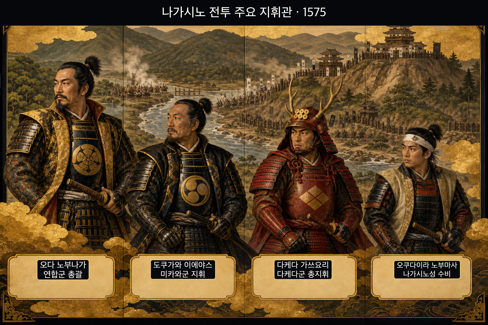
	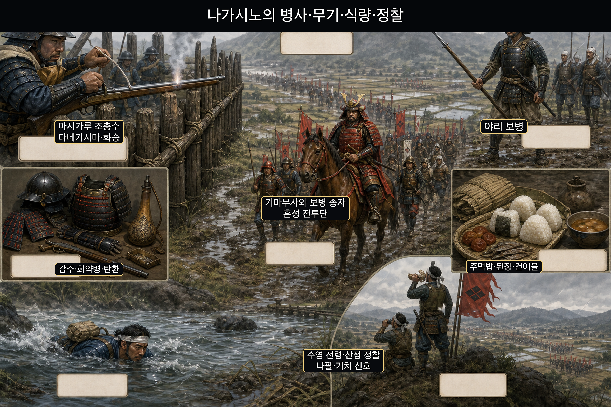
	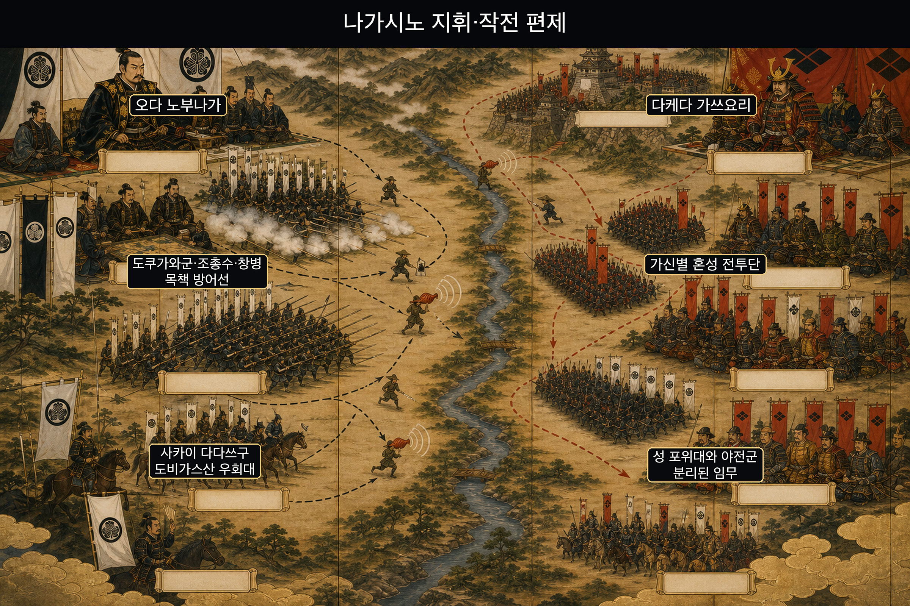
	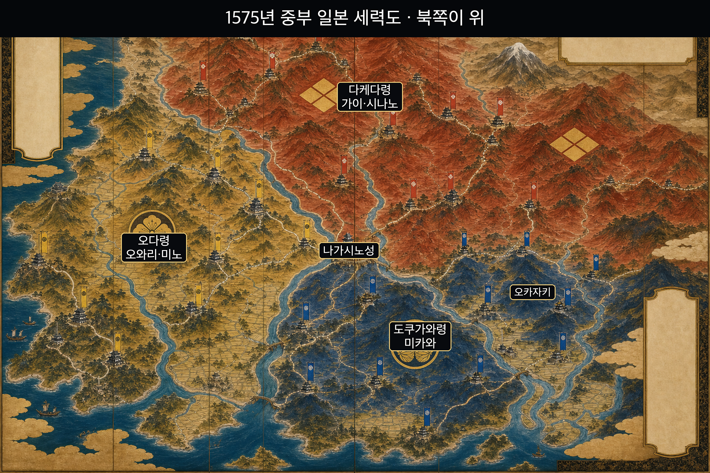
	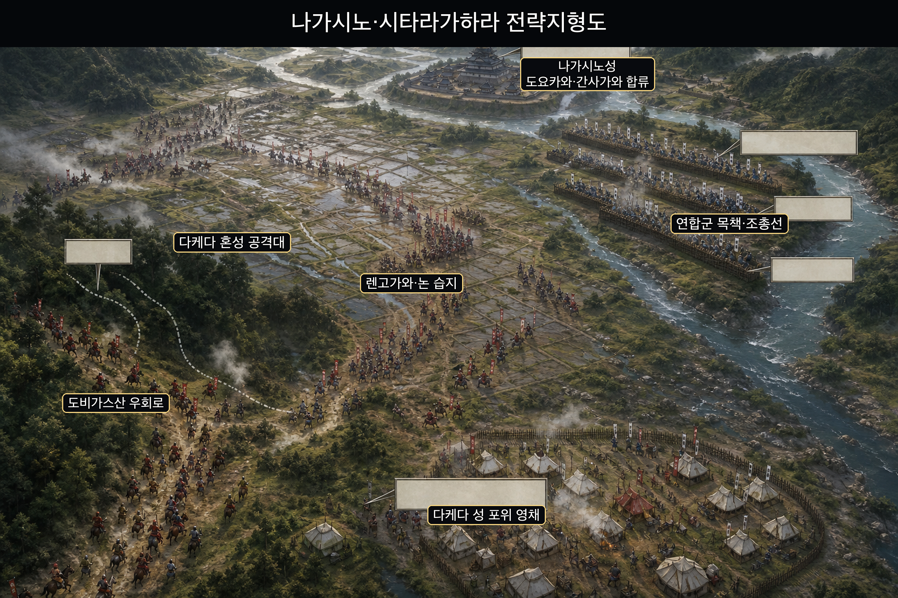
	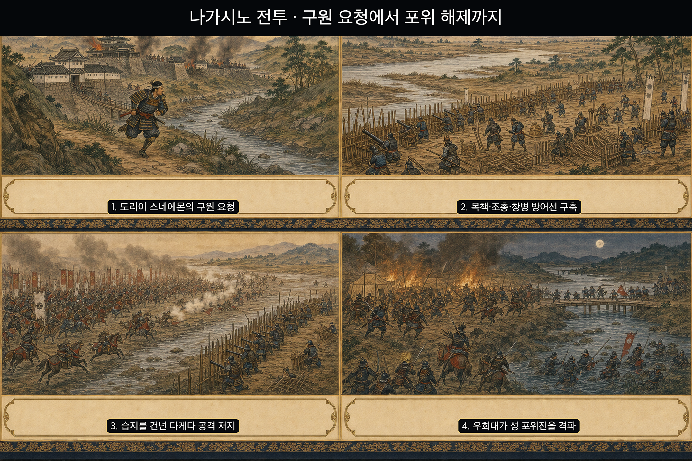
	**뒤에서 반복될 지형을 먼저 잡아두기**
	- 🏯 **▰** **나가시노성(長篠城)**은 두 하천이 만나는 작은 성으로 포위를 버티며 구원 시간을 벌었다.
	- 🌊 렌고가와와 논 습지는 **다케다군**의 접근 속도와 대형을 흐트러뜨렸다.
	- 🪵 목책은 조총수의 재장전 시간을 보호하고 창병과 사수의 역할을 연결했다.
	- ⛰️ 도비가스산은 **사카이 다다쓰구** 우회대가 포위진 측후방으로 접근한 길이었다.
	#### 작은 성이 구원군이 올 때까지 시간을 사다
	**오쿠다이라 노부마사**의 수비대는 포위 속에서도 버텼고 전령이 구원을 요청했습니다. 성의 저항은 단순한 결사가 아니라 외부 연합군이 도착할 시간을 사는 임무였습니다.
	#### 연합군이 조총·창병·목책을 한 체계로 묶다
	**오다 노부나가**와 **도쿠가와 이에야스**는 렌고가와 뒤에 목책을 세우고 조총수와 창병을 배치했습니다. 동시대 기록은 조총 약 1,000정을 전하지만 유명한 3단 윤회사격은 확정하지 않습니다.
	#### 다케다 혼성 전투단이 진흙과 목책 앞에서 분절되다
	**다케다 가쓰요리**의 군대는 기병만으로 이루어진 돌격대가 아니었습니다. 기마무사와 보병 종자가 함께 공격했지만 습지·하천·목책 때문에 충격이 나뉘었고 방어군은 준비된 위치에서 이를 받아냈습니다.
	#### 도비가스산 우회대가 성 포위진을 깨다
	**사카이 다다쓰구**의 별동대가 야간에 우회해 다케다의 성 포위 거점을 공격했습니다. 정면 방어와 성 구원이 연결되면서 다케다군은 한 전선에 힘을 모으기 어려워졌습니다.
	#### 패배 회피 분기점 — 준비된 방어선을 정면으로 시험하지 않았다면
	**가쓰요리**가 성 포위를 풀고 연합군의 보급과 우회대부터 견제하거나 비가 그친 뒤 다른 지점을 탐색했다면 병력 손실을 줄일 수 있었습니다.
	#### 法 한눈 비교 — 곡제·관도·주용
	<table fit-page-width="true" header-row="true">
	<tr><td>진영</td><td>곡제</td><td>관도</td><td>주용</td></tr>
	<tr><td>**오다·도쿠가와군**</td><td>조총·창병·목책·우회대 결합</td><td>연합 지휘와 역할 분담</td><td>탄약과 진지를 지속 사용</td></tr>
	<tr><td>**다케다군**</td><td>가신별 혼성 공격대</td><td>포위대와 야전군 분리</td><td>공격 반복으로 정예 소모</td></tr>
	</table>
	**〈다케다군 (패)〉** 빠른 병력의 강점을 준비된 습지 전면에서 소모했습니다.
	<table fit-page-width="true" header-row="true">
	<tr><td>요소</td><td>판단</td></tr>
	<tr><td color="orange_bg">🤝 **道**</td><td>가신별 용맹이 하나의 회피·집중 계획으로 묶이지 않았습니다.</td></tr>
	<tr><td color="blue_bg">🌤️ **天**</td><td>비와 젖은 땅이 접근을 어렵게 했습니다.</td></tr>
	<tr><td color="green_bg">🧭 **地**</td><td>논·하천·목책이 기동력을 나눴습니다.</td></tr>
	<tr><td color="purple_bg">🎖️ **將**</td><td>**가쓰요리**가 준비된 전면의 반복 공격을 멈추지 않았습니다.</td></tr>
	<tr><td color="yellow_bg">⚙️ **法**</td><td>포위대와 야전군이 서로 지원하기 어려웠습니다.</td></tr>
	</table>
	🏳️ **패군 측 결과** 유력 가신과 정예를 잃고 작전 주도권이 약화됐습니다.
	**〈오다·도쿠가와 연합군 (승)〉** 서로 다른 병종과 두 다이묘의 군대를 지형 위에서 결합했습니다.
	<table fit-page-width="true" header-row="true">
	<tr><td>요소</td><td>판단</td></tr>
	<tr><td color="orange_bg">🤝 **道**</td><td>성 구원과 야전 승리라는 공동 목표가 두 군대를 묶었습니다.</td></tr>
	<tr><td color="blue_bg">🌤️ **天**</td><td>젖은 지형을 공격자 감속 장치로 받아들였습니다.</td></tr>
	<tr><td color="green_bg">🧭 **地**</td><td>목책·하천·습지를 방어 깊이로 만들었습니다.</td></tr>
	<tr><td color="purple_bg">🎖️ **將**</td><td>**노부나가·이에야스·다다쓰구**가 역할을 나눴습니다.</td></tr>
	<tr><td color="yellow_bg">⚙️ **法**</td><td>조총수·창병·우회대를 상호 보완 편제로 운용했습니다.</td></tr>
	</table>
	🏆 **승군 측 결과** 성을 구하고 다케다의 반복 공격을 격퇴했습니다.
	##### 法을 압축하지 않고 보기 — 곡제·관도·주용
	**곡제 曲制(곡제): 부대를 어떻게 나누고 결합했는가**
	<table><tr><td>진영</td><td>운용</td></tr>
	<tr><td>**연합군**</td><td>조총수·창병·우회대를 기능별 배치</td></tr>
	<tr><td>**다케다군**</td><td>가신별 공격이 차례로 소모</td></tr></table>
	**관도 官道(관도): 누가 명령하고 어떻게 전달했는가**
	<table><tr><td>진영</td><td>운용</td></tr>
	<tr><td>**연합군**</td><td>노부나가·이에야스가 정면과 구원을 분담</td></tr>
	<tr><td>**다케다군**</td><td>가쓰요리의 결전 아래 현장 의견 수렴 약화</td></tr></table>
	**주용 主用(주용): 군량·장비·전투 지속 능력을 어떻게 썼는가**
	<table><tr><td>진영</td><td>운용</td></tr>
	<tr><td>**연합군**</td><td>화약·탄환·목재를 방어 체계로 전환</td></tr>
	<tr><td>**다케다군**</td><td>정예를 반복 정면공격에 투입</td></tr></table>

---

## 5. 핵심 통찰·실생활 적용·생활루틴 {toggle="true" color="purple_bg"}
	### 핵심 통찰
	이번 구절은 배수진을 찬양하지 않습니다. 퇴로 차단은 마지막 선택지를 없앨 뿐, 옆 사람이 나를 도울 것이라는 믿음과 행동 순서를 만들지 못합니다. **사람을 몰아붙이지 말고 실패해도 다음 동작이 이어지는 구조를 만드십시오.**
	### 3교대 현장 적용
	에러가 났을 때 목소리가 큰 사람 하나에게 모두 맞추면 그 사람이 피로하거나 화가 났을 때 팀 전체가 멈춥니다. 조치자·모니터링·보고·복구 확인을 먼저 나누고, 각자가 자기 작업을 복명복창하며 상위 보고 시점을 정해야 합니다. 강한 사람은 현장 조치에, 신중한 사람은 로그·교차확인에 두면 강유개득이 됩니다.
	### 인물관찰과 연결
	손실을 지나치게 두려워하는 사람에게 돌격을 강요하거나, 조급한 사람에게 전체 판단을 맡기면 성향이 약점으로 폭발합니다. 반대로 손실회피형에게 최종 확인을, 행동형에게 초기 차단을 맡기고 서로의 완료 조건을 연결하면 성향의 차이가 안전장치가 됩니다.
	### 재수없음 시리즈
	**에러 때 역할을 말로 확인하지 않고 모두가 눈치로 같은 일을 하면 재수가 없습니다.** 강한 사람은 중복 조치하고 신중한 사람은 보고를 미루며, 정작 모니터링과 복구 확인이 비게 됩니다. 조치 시작 30초 안에 “현장·모니터·보고·기록” 네 역할을 소리 내어 정하십시오.
	### 하루 한 가지 루틴
	근무 시작 뒤 첫 인계 때 60초만 사용해 오늘의 네 역할과 대체자를 메모하십시오. “제가 현장, A가 모니터, B가 보고, 조장이 승인; 부재 시 A↔B 교대”처럼 적고 한 번 복창합니다. 퇴근 전에는 실제로 역할 공백이 있었는지 한 줄만 남기십시오.

---
