> 고선용병자, 휴수약사일인, 부득이야. — 좋은 지휘는 사람을 몰아붙이는 힘이 아니라 서로 손을 놓을 수 없게 만드는 형세다.

## 1. 원문 + 독음 + 직역 + 한자어 뜻풀이

故善用兵者, 攜手若使一人, 不得已也. 고선용병자, 휴수약사일인, 부득이야.

	**직역** 그러므로 군대를 잘 쓰는 자는 손을 맞잡게 하여 한 사람을 부리는 것과 같게 하니, 그렇게 하지 않을 수 없게 하기 때문이다.

앞 구절은 군정과 지형이 강한 자와 유약한 자를 모두 제자리에 놓는다고 했습니다. 이 문장은 그 결과를 한 장면으로 압축합니다. 병사들이 우정 때문에 손을 잡는 것이 아닙니다. 한쪽이 멈추면 모두가 위험해지고, 한쪽이 움직이면 옆 부대도 움직여야 살 수 있도록 임무·신호·지형·출구를 묶었기 때문에 하나처럼 행동합니다.

#### 善用兵者(선용병자) — 병사를 세게 쓰는 사람이 아니라 조건을 잘 쓰는 사람
`善`은 착하다는 뜻에 머물지 않고 능숙하고 알맞다는 뜻이며, `用兵`은 병력을 실제 목적에 맞게 운용하는 일입니다. 좋은 지휘관은 모든 병사의 마음을 똑같이 만들려 하지 않습니다. 보병이 버티는 동안 기병이 돌아들고, 정찰이 빈틈을 알리는 순간 예비대가 움직이도록 서로 다른 능력을 하나의 시간표에 묶습니다.

#### 攜手(휴수) — 손을 잡는다는 것은 옆 사람의 다음 동작을 아는 것
`攜`는 손 수(手)를 품고 함께 이끈다는 뜻입니다. 여기서 손을 맞잡음은 감정적 친밀감보다 행동의 연결입니다. 방진의 방패와 창, 기병의 돌파와 보병의 압박, 전령의 보고와 지휘관의 예비대 투입이 서로 끊기지 않을 때 수천 명의 손이 한 몸처럼 이어집니다.

#### 若使一人(약사일인) — 수많은 부대가 하나의 의도를 실행하다
`若`은 같다는 비교이고, `使`는 부린다는 말이며, `一人`은 한 사람입니다. 이는 맹목적 획일화가 아닙니다. 각 부대가 다른 임무를 맡되 공통 목표와 전환 신호를 공유하여, 한 사람의 오른손과 왼손처럼 서로 다른 일을 동시에 수행하는 상태입니다.

#### 不得已(부득이) — 강요가 아니라 다른 길이 사라진 형세
`得`은 얻다, `已`는 그치다이므로 `不得已`는 그만둘 수 없음, 달리할 수 없음을 뜻합니다. 손자는 공포로 퇴로를 막으라는 말만 하지 않습니다. 적의 움직임과 지형, 부대 간 상호의존이 협동을 가장 안전하고 합리적인 선택으로 만들게 하라는 뜻입니다. 다만 선택지를 인위적으로 없애는 방식은 윤리와 안전의 경계를 함께 따져야 합니다.

#### 글자들이 완성하는 한 장면
선용병자는 사람을 억지로 같은 성격으로 만들지 않습니다. 서로의 손이 닿도록 임무를 잇고, 각자의 행동이 옆 부대의 생존 조건이 되게 하며, 결국 흩어지는 것보다 함께 움직이는 편이 유일하고 합리적인 길이 되게 합니다. **하나처럼 움직이는 군대는 한 사람의 카리스마가 아니라 연결된 조건의 산물입니다.**

---

## 2. 전통 주석 기반 분석 {toggle="true" color="blue_bg"}
	- **조조(曹操)** — "**부대가 서로 구원하지 않으면 함께 위태로워지는 곳에 두라.** 그러면 명령을 기다려 억지로 합치는 것이 아니라 스스로 손을 맞잡게 된다."
	- **이전(李筌)** — "**한 몸은 손발이 다투지 않으니 군대도 형세를 따라 서로 응하게 하라.** 억지 힘보다 달리할 수 없는 자연스러운 연결을 만들어야 한다."
	- **두목(杜牧)** — "**사지에 둔다는 겉모양만 흉내 내지 말라.** 구원 관계와 지휘가 없으면 궁지의 병사는 하나가 되지 않고 각자 살길부터 찾는다."
	- **매요신(梅堯臣)** — "`攜手`와 `不得已`를 함께 보아라. **손잡음은 정이 두터워서가 아니라 형세가 서로 놓지 못하게 해서 생긴다.**"
	- **장예(張預)** — "**앞뒤·좌우의 임무와 응원 순서를 먼저 정하라.** 한 부대의 움직임이 다음 부대의 행동을 불러야 비로소 한 사람처럼 부릴 수 있다."
	- **왕석(王晳)** — "**같이 움직이지 않으면 함께 잃는 이해관계를 분명히 하라.** 공동 위험과 공동 출구가 있어야 많은 판단이 한 방향으로 모인다."
	- **가림(賈林)** — "**신호·거리·예비대를 서로 닿게 두라.** 돕고 싶어도 닿지 못하면 손을 잡았다고 할 수 없으니 실제 행동 경로를 만들어야 한다."
	- **두우(杜佑)** — "**편제·명령·군량을 한 체계로 잇고 어느 한 고리가 끊겨도 대신할 길을 두라.** 제도가 군대를 한 사람으로 만든다."
	- **진호(陳皞)** — "**사람의 마음만 탓하지 말고 반드시 함께해야 사는 형세를 완성하라.** 그때 용감한 자와 두려운 자가 같은 때에 나아간다."

---

## 3. 교차 설명 {toggle="true" color="green_bg"}
	### ① 손자병법 안의 연결
	앞의 `齊勇如一, 政之道也(제용여일, 정지도야 — 용기를 가지런히 해 하나처럼 만드는 것은 군정의 길이다)`가 제도적 원인을 말했다면, 이번 `攜手若使一人(휴수약사일인 — 손을 잡아 한 사람을 부리는 듯하다)`은 관찰 가능한 결과를 말합니다. 그 연결을 완성하는 말이 `不得已(부득이 — 달리할 수 없음)`입니다. 협동은 구호가 아니라 흩어질 수 없는 임무 구조에서 나옵니다.
	「세편」의 `任勢者, 其戰人也, 如轉木石(임세자, 기전인야, 여전목석 — 형세를 맡기는 자가 사람을 싸우게 함은 나무와 돌을 굴리는 것과 같다)`도 같은 원리입니다. 다만 사람은 목석이 아니므로, 현대 적용에서는 위험을 숨기거나 퇴로를 빼앗는 강압이 아니라 목표·정보·권한·지원의 상호의존을 설계해야 합니다.
	### ② 클라우제비츠 『전쟁론』
	클라우제비츠의 마찰은 계획된 동시 행동을 지연과 오해로 흩뜨립니다. 가우가멜라에서 마케도니아군의 두 번째 전열과 측방 경계대는 포위를 받더라도 각 부대가 무엇을 해야 하는지 미리 정해 둔 장치였습니다. 개인의 영웅성보다 예측 가능한 대응이 군대를 한 몸처럼 보이게 했습니다.
	그러나 손자의 `不得已`를 클라우제비츠의 강제 개념과 곧바로 같게 볼 수는 없습니다. 전쟁의 정치 목적과 적의 의지를 꺾는 강제는 대외 관계의 층위이고, 이 구절은 아군 내부의 행동 결합을 다룹니다. 공통점은 선택 구조를 설계한다는 데 있고, 차이는 누구의 선택을 어떤 목적으로 제한하는가에 있습니다.
	### ③ 미야모토 무사시 『오륜서』
	『오륜서』의 물은 그릇에 따라 모양을 바꾸되 본성을 잃지 않습니다. 여러 병종을 하나처럼 쓴다는 것은 모두를 장창병이나 기병으로 만드는 일이 아니라, 상황에 맞춰 서로 다른 기능을 같은 박자에 넣는 일입니다. 가우가멜라의 경보병·방진·기병이 그 예입니다.
	무사시가 말하는 박자는 상대의 박자를 알고 그 어긋남을 치는 데 있습니다. 호뢰관에서 당군은 하군의 배고픔과 피로, 대열 이완이 같은 순간에 겹칠 때까지 기다렸습니다. 기다림과 돌격은 반대 행동이지만 하나의 의도 아래 이어졌습니다.
	### ④ 오자병법·육도삼략
	『오자병법』의 `一人投命, 足懼千夫(일인투명, 족구천부 — 한 사람이 목숨을 던지면 천 사람도 두렵게 할 수 있다)`는 결사의 힘을 말하지만, 결사만으로 지속 가능한 협동이 생기지는 않습니다. 장수가 병사와 고락을 함께하고 상벌과 명령을 믿게 해야 각자의 투지가 옆 부대의 행동과 결합합니다.
	『육도』가 각기 다른 재능을 골라 직책에 쓰라고 한 취지는 `若使一人`을 획일화로 오독하지 않게 합니다. 정찰·방어·돌격·수송은 서로 다른 기술입니다. 이들을 같은 목표와 전환 신호로 잇는 편제가 바로 한 사람의 수족을 만드는 방식입니다.
	### ⑤ 현대 심리학·군사학
	현대의 공유 정신모형과 상호의존 과업 연구는 팀원이 동료의 역할·정보·다음 행동을 예측할 때 조정 비용이 낮아진다고 설명합니다. 단순한 집단응집성보다 누가 무엇을 알고 언제 넘겨주는지가 성과를 더 직접적으로 좌우합니다. `攜手`는 친밀감보다 이 예측 가능성에 가깝습니다.
	카너먼의 관점에서 위기 때의 확신은 실제 협동을 과대평가하게 만들 수 있습니다. “우리는 한 팀”이라는 인상 대신 보고 시간, 복명복창, 대체자, 중단 기준을 관찰해야 합니다. 판단은 **협동이 보이는가 → 확증편향 가능성은 없는가 → 누락 시 결과는 무엇인가 → 어떤 교차확인으로 고칠 것인가**의 순서로 점검해야 합니다.

---

## 4. 역사적 실증 사례 {toggle="true"}
	### 서양 — **마케도니아 왕국군** vs **아케메네스 페르시아군** │ 가우가멜라 전투(Battle of Gaugamela, BCE 331)
	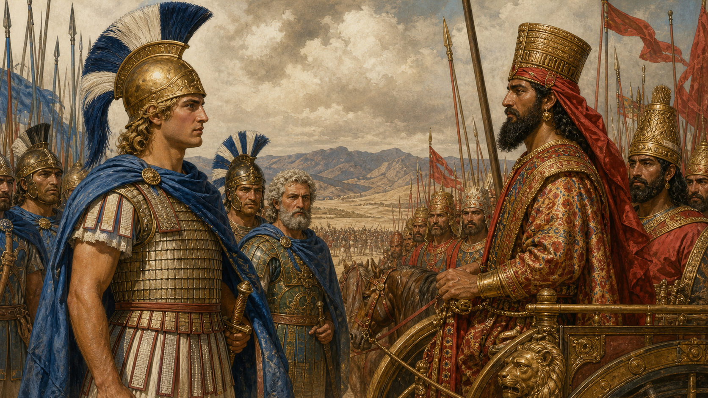
	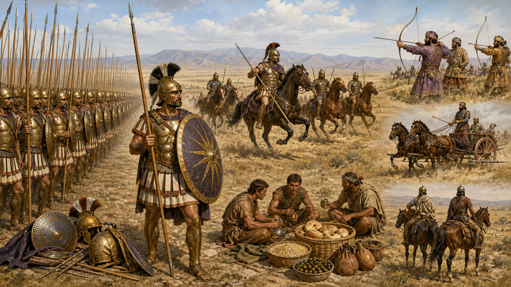
	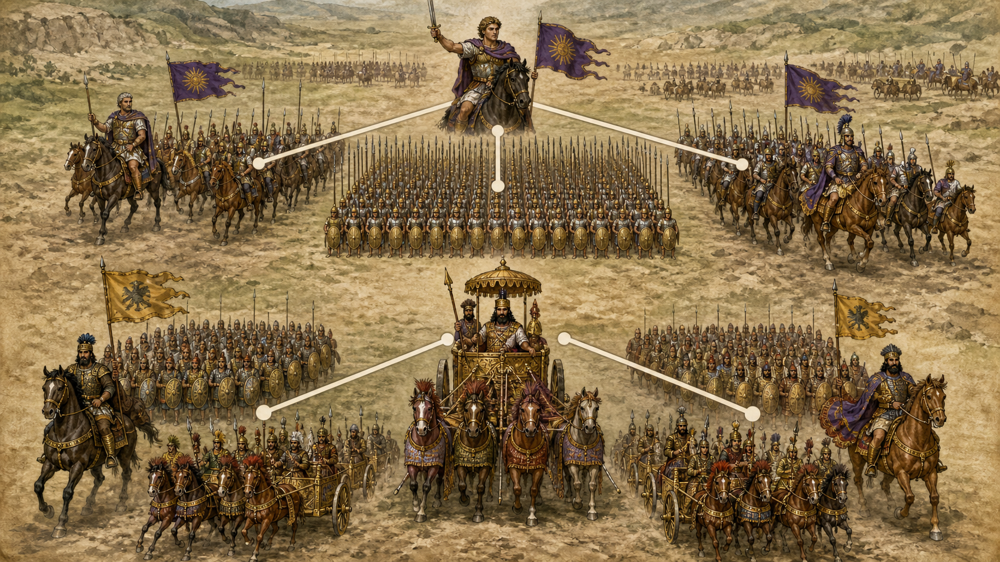
	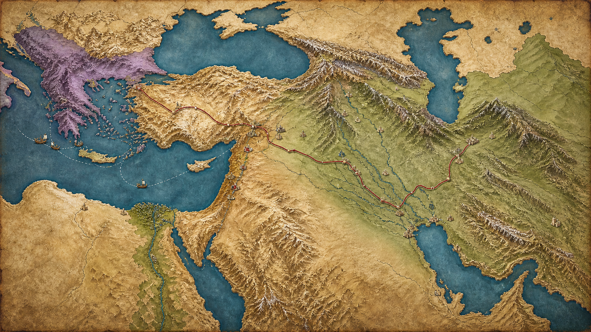
	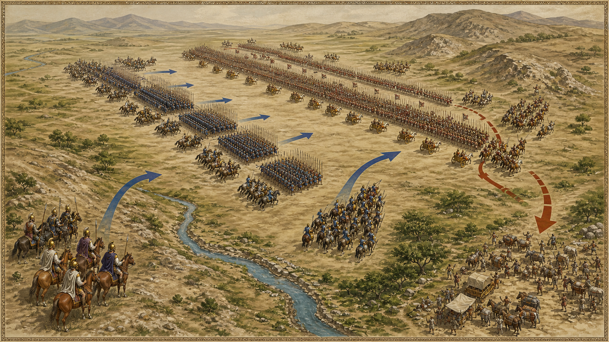
	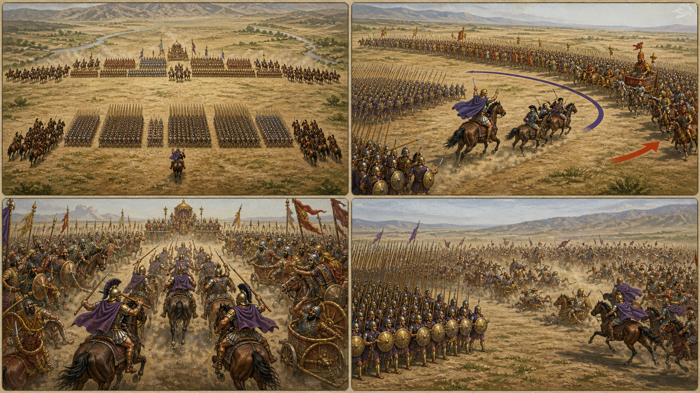
	**뒤에서 반복될 지형을 먼저 잡아두기**
	- 넓고 평탄한 가우가멜라 평원은 **다리우스 3세**가 전차와 수적 우세를 쓰려고 고른 공간이었지만, 긴 전선의 틈도 키웠습니다.
	- 🌊 **부모두스강(Bumodus)** 일대는 고대 서술의 기준점이지만 정확한 전장 위치는 오늘날에도 논쟁적입니다.
	- **▰** **아르벨라(Arbela)**는 전장 동쪽의 후방 거점이자 패주 방향으로 전해집니다.
	- 페르시아 좌익의 넓은 우회 공간은 마케도니아 우익을 감싸려는 기병을 끌어냈고, 그 이동이 중앙 가까이에 틈을 만들었습니다.
	- 마케도니아 좌익은 **파르메니온**이 버티는 고정점이었고, 우익은 **알렉산드로스**가 비스듬히 이동하며 결정을 만든 기동점이었습니다.

	#### 다리우스가 전차를 위해 평원을 다듬고 알렉산드로스가 야습을 거부하다
	**다리우스 3세**는 이수스의 좁은 지형과 달리 기병·낫전차를 펼칠 수 있는 평원을 골랐습니다. 고대 사료의 병력 수는 과장이 커서 확정할 수 없지만 페르시아군이 훨씬 긴 전선과 강한 기병 날개를 가졌다는 점은 비교적 분명합니다. **파르메니온**이 야습을 제안했다는 전승과 **알렉산드로스**의 거부는 아리아노스에 전하지만, 극적인 대화의 정확한 문구는 후대 서술로 경계해야 합니다.
	#### 두 번째 전열과 측방 경계대가 포위될 때의 손을 미리 정하다
	마케도니아군 중앙의 사리사 방진은 정면 압박을 맡고, 우익의 동료기병·히파스피스트·아그리아니 경보병은 돌파와 전차 저지를 맡았습니다. 뒤의 두 번째 전열은 적이 측후방으로 돌아오면 방향을 바꾸도록 편성됐습니다. 각 부대가 같은 일을 한 것이 아니라, 한쪽이 감싸이면 다른 쪽이 돌아서 손을 잡도록 임무가 맞물렸습니다.
	#### 오른쪽 사행이 페르시아 좌익 기병을 끌어내고 중앙의 틈을 열다
	**알렉산드로스**는 우익을 비스듬히 오른쪽으로 옮겼습니다. **다리우스**는 준비한 평원 밖으로 적이 빠져나가거나 자기 좌익이 돌아싸일 위험을 막아야 했고, 스키타이·박트리아 기병을 더 바깥으로 보냈습니다. 그 결과 페르시아 좌익과 중앙 사이의 연결이 늘어났습니다.
	#### 낫전차를 흘려보낸 경보병과 중앙을 찌른 쐐기
	페르시아 낫전차가 돌진하자 경보병은 투창으로 마부와 말을 공격하고, 일부 보병은 통로를 열어 전차를 뒤로 흘려보낸 뒤 처리했습니다. 이어 **알렉산드로스**는 동료기병을 쐐기로 묶어 열린 틈을 향해 방향을 틀었고 방진 일부가 정면에서 호응했습니다. 기병의 손과 보병의 손이 같은 목표인 **다리우스**의 지휘 중심을 향했습니다.
	#### 좌익의 위기가 추격을 끊고 군대 전체를 다시 붙잡다
	마케도니아 중앙에도 틈이 생겨 페르시아·인도 병력이 후방 진영까지 파고들었고, **파르메니온** 쪽은 강한 압박을 받았습니다. 구원 요청이 실제로 언제 도착했고 **알렉산드로스**의 회군을 결정했는지는 사료가 일치하지 않습니다. 분명한 것은 우익의 돌파만으로 전투가 끝나지 않았고, 좌익을 놓치면 승리도 무너질 수 있었다는 점입니다.
	#### 패배 회피 분기점 — 우익을 끝없이 따라가지 않고 중앙 예비를 남겼다면
	**다리우스**가 마케도니아의 사행을 추적하는 기병에 명확한 한계를 두고 왕 주변의 중앙 예비와 연결을 유지했다면, 쐐기가 파고들 단일한 틈은 좁아졌을 것입니다. 전차 돌격도 경보병 대응이 드러난 뒤 보병·기병 압박과 순차 결합했다면 일회성 충격으로 소모되지 않았을 가능성이 있습니다.
	#### 전투에서 사용된 속임수 — 사행 기동이 만든 의도 은폐와 강제 반응
	오른쪽 이동은 실제 기동이었지만 최종 목적이 단순한 이탈인지 우회인지 중앙 돌파를 위한 유인인지 페르시아 지휘부가 즉시 판별하기 어려웠습니다. 다만 아리아노스는 전술 행동을 자세히 전해도 **알렉산드로스**가 처음부터 완성된 유인 각본을 품었다고 명시하지 않습니다. 따라서 ‘계획된 거짓 후퇴’가 아니라 **실제 이동으로 상대의 대응을 강제하고 그 결과 생긴 틈을 이용한 기만적 운용**으로 한정합니다.
	#### 속임수 작동 구조
	**주체와 의도.** **알렉산드로스**는 우익의 포위를 피하면서 페르시아 좌익을 뻗게 하고 돌파할 공간을 찾으려 했습니다.
	**보인 신호와 믿은 이유.** 마케도니아 우익이 준비된 평원 가장자리로 계속 이동하자 **페르시아 지휘부**는 측면을 놓치거나 적을 전차 운용지 밖으로 내보낼 수 없었습니다.
	**유발된 행동과 결과.** 페르시아 기병이 바깥으로 늘어나 중앙 가까이에 틈이 생겼고, 동료기병과 보병의 결합 쐐기가 그 틈을 찔렀습니다.
	**사료의 경계.** 기동·추적·틈·돌파는 아리아노스 전승의 핵심이지만, 알렉산드로스의 사전 의도를 설명하는 현대식 ‘유인 계획’은 추론입니다. 병력 수, 회군 이유, 다리우스 도주 장면도 사료 간 차이가 큽니다.
	#### 속임수 일곱 질문
	1. **누가 누구를 속였는가?** **마케도니아 우익 지휘부**가 실제 사행 기동의 최종 목적을 **페르시아 좌익 지휘부**가 오판하게 만들었습니다.
	2. **어떤 사실이 거짓이었는가?** 명시적 거짓 신호는 확인되지 않습니다. 우익 이동이 최종 이탈이나 외곽 우회만을 뜻한다는 해석이 결과적으로 틀렸습니다.
	3. **어떤 사실은 진실이지만 오해를 유도했는가?** 마케도니아군이 실제로 오른쪽으로 이동했고 페르시아 좌익 측면을 위협한 사실이 중앙 돌파 의도를 가렸습니다.
	4. **상대는 왜 그것을 믿고 싶어 했는가?** **다리우스**는 준비한 평원과 기병의 포위 이점을 잃지 않아야 했습니다.
	5. **속임수가 없었어도 같은 오판이 발생했을까?** 긴 전선과 현장 시야 제한만으로도 틈은 생길 수 있었으나, 사행 기동이 그 압박을 크게 높였습니다.
	6. **속은 사람은 어떤 독립 확인을 생략했는가?** 좌익 추적과 중앙 연결을 동시에 감시하고 기병 이동의 중단선을 정하는 통제가 부족했습니다.
	7. **신뢰·동의·안전을 해치지 않으면서 같은 원리를 어디서 연습할 수 있는가?** 공개 규칙의 보드게임·스포츠에서 실제 한쪽 움직임으로 수비를 끌고 빈 공간을 활용하는 방식으로 연습할 수 있습니다.
	#### 시계편 兵者詭道也 — 이 전장에 해당하는 속이는 길
	<table fit-page-width="true" header-row="true">
	<tr><td>해당 구절·독음·뜻</td><td>전장의 장면</td></tr>
	<tr><td>用而示之不用 용이시지불용 — 쓰면서 쓰지 않는 듯 보인다</td><td>우익 사행은 실제 기동이었지만 중앙 돌파를 준비하는 공격적 쓰임은 즉시 드러나지 않았습니다.</td></tr>
	<tr><td>近而示之遠 근이시지원 — 가까이 있으면서 멀리 있는 듯 보인다</td><td>결정타를 낼 동료기병이 중앙의 틈 가까이에 있으면서도 바깥 측면 이동이 시선을 끌었습니다. 이 대응은 사료에 적힌 행동에서 추론한 적용입니다.</td></tr>
	</table>
	#### 法 한눈 비교 — 곡제·관도·주용
	<table fit-page-width="true" header-row="true">
	<tr><td>진영</td><td>곡제(편제)</td><td>관도(지휘)</td><td>주용(보급·지속)</td></tr>
	<tr><td>**마케도니아군**</td><td>방진·경보병·기병·2선 결합</td><td>우익 결심과 좌익 버팀의 분담</td><td>훈련된 장비 운용으로 짧은 결전</td></tr>
	<tr><td>**페르시아군**</td><td>긴 전선과 기병·전차의 병렬</td><td>왕 중심 지휘와 먼 날개의 연결 약화</td><td>평원 준비를 했지만 전차·기병을 순차 결합하지 못함</td></tr>
	</table>
	**〈아케메네스 페르시아군 (패)〉** 수적·기동 우세가 긴 전선의 단절로 바뀌었습니다.
	<table fit-page-width="true" header-row="true">
	<tr><td>요소</td><td>판단</td></tr>
	<tr><td color="orange_bg">🤝 **道**</td><td>다민족 부대의 충성 문제가 아니라 왕의 이탈 신호가 전체 저항 의지를 한꺼번에 꺾는 구조가 취약했습니다.</td></tr>
	<tr><td color="blue_bg">🌤️ **天**</td><td>밤새 경계했다는 고대 전승은 피로 가능성을 시사하지만 실제 영향의 크기는 확정하기 어렵습니다.</td></tr>
	<tr><td color="green_bg">🧭 **地**</td><td>평원은 기병과 전차를 펼쳤지만 긴 전선과 틈도 만들었습니다.</td></tr>
	<tr><td color="purple_bg">🎖️ **將**</td><td>**다리우스**는 우익 추적·중앙 방호·좌익 전투를 하나의 전환 계획으로 묶지 못했습니다.</td></tr>
	<tr><td color="yellow_bg">⚙️ **法**</td><td>전차·기병·보병의 공격 시점과 중앙 예비가 유기적으로 연결되지 않았습니다.</td></tr>
	</table>
	🏳️ **패군 측 결과** **다리우스**가 이탈하자 전열이 붕괴했고, 마케도니아군은 메소포타미아와 제국 중심부로 진입할 길을 얻었습니다.
	**〈마케도니아 왕국군 (승)〉** 서로 다른 병종이 위험을 넘겨받으며 한 사람의 양손처럼 움직였습니다.
	<table fit-page-width="true" header-row="true">
	<tr><td>요소</td><td>판단</td></tr>
	<tr><td color="orange_bg">🤝 **道**</td><td>오랜 원정과 승리 경험, 왕의 선두 지휘가 공동 의도를 유지했습니다.</td></tr>
	<tr><td color="blue_bg">🌤️ **天**</td><td>주간 결전으로 복잡한 기동과 신호를 가시 범위 안에서 수행했습니다.</td></tr>
	<tr><td color="green_bg">🧭 **地**</td><td>평원을 피하지 않고 사행 기동으로 적의 넓은 전선을 오히려 늘였습니다.</td></tr>
	<tr><td color="purple_bg">🎖️ **將**</td><td>**알렉산드로스·파르메니온·크라테로스**가 우익 돌파·좌익 버팀·중앙 압박을 분담했습니다.</td></tr>
	<tr><td color="yellow_bg">⚙️ **法**</td><td>경보병의 전차 대응, 방진의 압박, 기병 쐐기, 두 번째 전열을 연결했습니다.</td></tr>
	</table>
	🏆 **승군 측 결과** 중앙 지휘부를 압박해 페르시아군의 수적 우세를 전장 전체의 공동 행동으로 전환하지 못하게 했습니다.
	##### 法을 압축하지 않고 보기 — 곡제·관도·주용
	**곡제 曲制(곡제): 부대를 어떻게 나누고 결합했는가**
	<table><tr><td>진영</td><td>운용</td></tr>
	<tr><td>**마케도니아군**</td><td>사리사 방진을 중심에 두고 히파스피스트·아그리아니·동료기병을 우익에, 테살리아 기병을 좌익에 두며 후방 2선을 포위 대응대로 편성했습니다.</td></tr>
	<tr><td>**페르시아군**</td><td>다민족 보병 중앙과 양익의 강한 기병, 전면의 낫전차를 넓게 펼쳤으나 멀어진 좌익과 왕의 중앙을 잇는 예비가 부족했습니다.</td></tr></table>
	**관도 官道(관도): 누가 명령하고 어떻게 전달했는가**
	<table><tr><td>진영</td><td>운용</td></tr>
	<tr><td>**마케도니아군**</td><td>**알렉산드로스**가 우익 결정을 직접 내리고 **파르메니온**에게 좌익을 맡겼습니다. 구원 요청과 회군의 세부는 사료 논쟁을 남깁니다.</td></tr>
	<tr><td>**페르시아군**</td><td>**다리우스**가 중앙에서 전체를 지휘했지만 수 킬로미터에 이른 것으로 전해지는 전선의 양익 반응을 실시간 통제하기 어려웠습니다.</td></tr></table>
	**주용 主用(주용): 군량·장비·전투 지속 능력을 어떻게 썼는가**
	<table><tr><td>진영</td><td>운용</td></tr>
	<tr><td>**마케도니아군**</td><td>사리사·방패·투창·기병 장비를 병종별로 쓰고, 원정 보급의 부담 때문에 장기 대치보다 훈련된 결전 속도를 택했습니다. 정찰과 전장 사전 관측으로 지형을 확인했습니다.</td></tr>
	<tr><td>**페르시아군**</td><td>평원을 정리하고 전차 운용 공간과 대군의 숙영·식량을 마련했으나, 전차가 경보병 대응에 막힌 뒤 장비 우세를 지속 압박으로 바꾸지 못했습니다.</td></tr></table>

	### 동양 — **당군** vs **하(夏)군** │ 호뢰관 전투(虎牢關之戰, 621)
	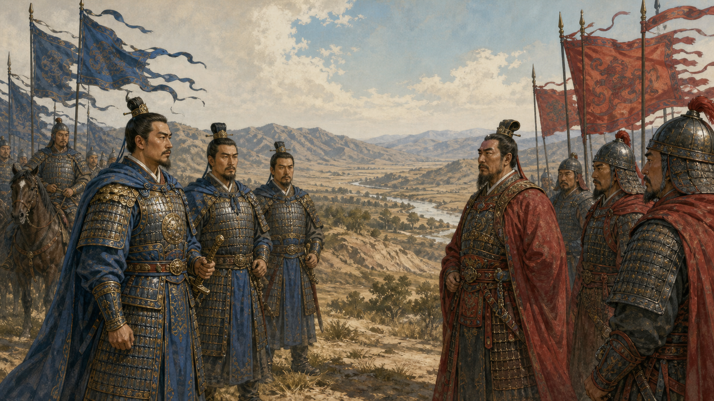
	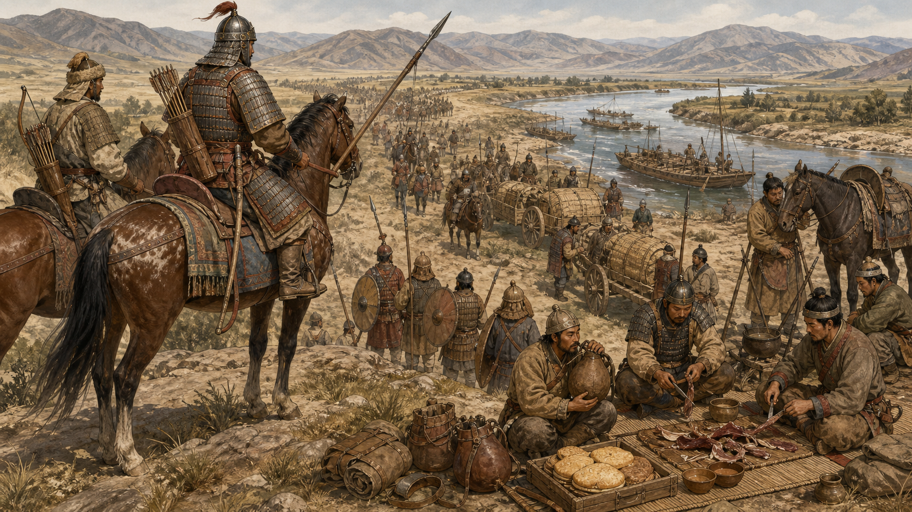
	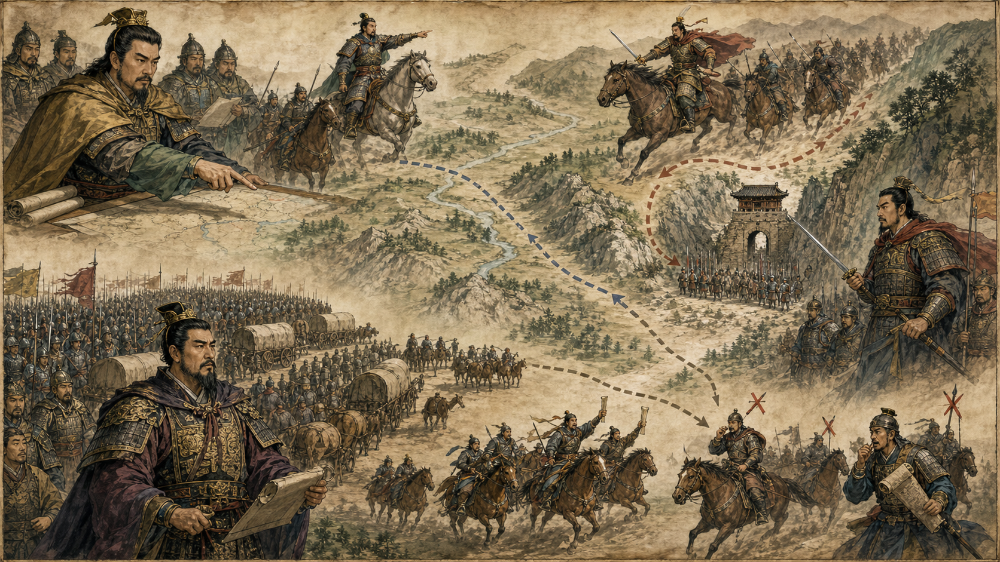
	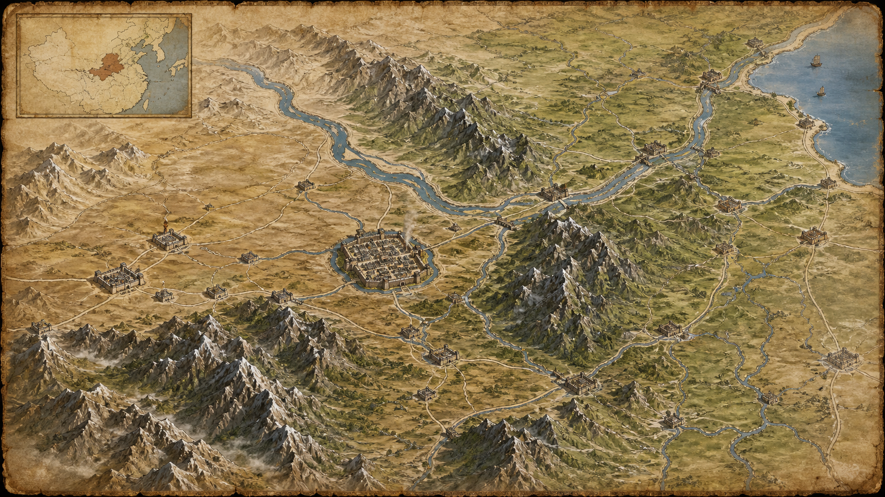
	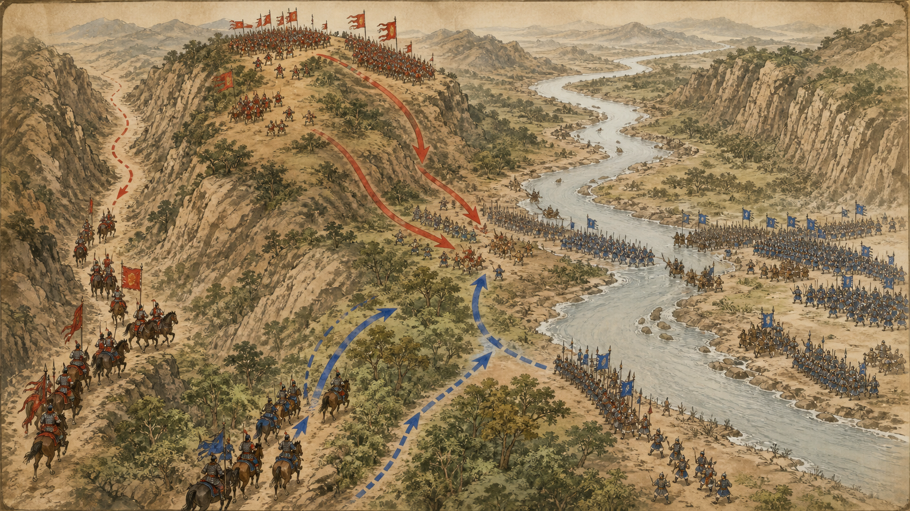
	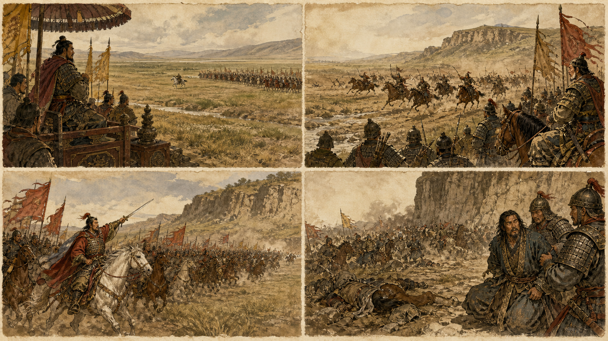
	**뒤에서 반복될 지형을 먼저 잡아두기**
	- 🏯 **▰** **호뢰관(虎牢關)**은 동쪽에서 **▰** **낙양(洛陽)**으로 들어가는 좁은 관문으로, 당군 열세를 보호했습니다.
	- 🌊 **황하(黃河)**는 하군의 북쪽 후방과 도주·보급 방향을 제한하는 큰 수계였습니다.
	- 🌊 **변수(汴水)** 일대의 진영과 수로는 하군의 대군이 오래 머물 때 식량과 말먹이 부담을 키웠습니다.
	- ⛰️ 호뢰 동쪽의 고지와 협착지는 **이세민**의 소수 병력이 대군의 전개를 늦추고 기병 돌파 시점을 관찰하게 했습니다.
	- **▰** **낙양(洛陽)**은 **왕세충**의 정(鄭)이 버티던 포위 목표였고, **두건덕**은 이를 구원하려다 호뢰에서 막혔습니다.

	#### 낙양 포위를 풀지 않고 호뢰에 별도 손을 세우다
	**이세민**은 **왕세충**을 포위한 병력을 모두 돌리지 않고, 일부는 **▰** **낙양(洛陽)**에 남기고 자신은 정예를 이끌어 **▰** **호뢰관(虎牢關)**을 막았습니다. 두 전선을 분리했지만 목적은 하나였습니다. 하군을 관문에서 붙잡아 정군과 합류하지 못하게 하면 낙양 포위도 계속될 수 있었습니다.
	#### 두건덕의 대군을 굶기고 지치게 하며 결전을 미루다
	**두건덕**은 사료상 10만 또는 12만으로 전하지만 전근대 수치는 과장 가능성이 큽니다. 분명한 것은 하군이 더 큰 구원군이었고 좁은 관문에서 병력을 충분히 펼치기 어려웠다는 점입니다. **이세민**은 도전을 받아 즉시 싸우지 않고 보급선을 괴롭히며 피로와 식량 부족이 드러나기를 기다렸습니다.
	#### 말을 풀어놓은 기병이 떠난 듯 보이고 하군이 대기 속에서 흐트러지다
	『구당서』·『자치통감』 계열 서술에는 **이세민**이 말을 풀어놓아 말먹이를 먹게 하며 기병이 물러난 듯 보이게 했고, **두건덕**의 군대가 아침부터 진을 벌인 채 정오 무렵 지치고 굶주렸다는 내용이 전합니다. 이를 완전한 ‘기병 이탈 위장’으로 단정하기보다, 실제 휴식·급양 행동을 약세와 이탈 신호로 읽게 한 유도였다고 보는 편이 안전합니다.
	#### 먼저 물러나는 하군 전열에 소수 기병이 균열을 만들다
	하군 병사들이 앉거나 물을 마시고 대열이 느슨해지며 철수 조짐을 보이자 당군 기병이 시험 공격을 가했습니다. 전면의 동요가 확인되자 **이세민**은 정예 기병을 이끌고 깊이 돌입했고 보병이 뒤따랐습니다. 기다리던 여러 손이 같은 신호에 붙었습니다.
	#### 당의 깃발이 하군 뒤 고지에 보이자 퇴각이 붕괴하다
	**이세민**과 기병대가 하군 진영을 관통해 후방 고지에 당 깃발을 세웠다는 전승은 심리적 붕괴의 장면을 전합니다. 앞에서는 당군이 밀고 뒤에서는 당 깃발이 보이자 하군은 퇴로와 지휘 중심을 함께 잃었습니다. **두건덕**은 부상해 붙잡혔고, 이 소식은 **왕세충**의 항복으로 이어졌습니다.
	#### 패배 회피 분기점 — 지친 대열을 철수시킨 뒤 다른 도하·보급로를 택했다면
	**두건덕**이 관문 정면에서 장시간 대기하지 않고 하남의 다른 거점을 공격해 당군의 낙양 포위를 흔들거나, 철수 전에 후위·고지·기병 예비를 세웠다면 당군의 돌입이 곧 전군 붕괴로 이어지지 않았을 것입니다. 부하 **능경**의 우회·지구전 계책 전승은 세부가 후대 편찬을 거쳤지만 정면 대치 외 대안이 있었음을 보여줍니다.
	#### 전투에서 사용된 속임수 — 기병 이탈처럼 보인 방목과 공격 시점 은폐
	당군은 소수라는 약점을 감추기보다 오히려 말을 풀어 전투 의지가 낮거나 기병이 떠난 듯한 신호를 보였다고 전해집니다. 하군은 당군이 즉시 나오지 않자 오래 대기했고, 철수와 휴식이 겹치는 순간 공격을 받았습니다. 이 기만의 핵심은 가짜 병력을 꾸민 것이 아니라 **언제 싸울지를 숨겨 상대가 스스로 대형을 풀게 한 것**입니다.
	#### 속임수 작동 구조
	**주체와 의도.** **이세민**은 하군의 수적 우세가 피로·허기·대기 혼란으로 약해질 때까지 결전 의도를 감추려 했습니다.
	**보인 신호와 믿은 이유.** 말을 풀어 먹이고 관문 안에서 응전하지 않는 모습은 당 기병의 이탈 또는 소극적 방어처럼 읽힐 수 있었습니다.
	**유발된 행동과 결과.** **하군**은 오래 대기하다 대열이 느슨해졌고, 철수 조짐이 나타난 순간 당 기병의 시험 공격과 전군 돌격을 연달아 받았습니다.
	**사료의 경계.** 방목·대기·피로·공격 시점은 전통 사서에 근거하지만 세부 대사와 정확한 병력 수, 모든 하군이 ‘기병 이탈’을 동일하게 믿었다는 해석은 확정할 수 없습니다. 당 왕조의 승리 서사가 **이세민**의 통찰을 강조했을 가능성도 고려해야 합니다.
	#### 속임수 일곱 질문
	1. **누가 누구를 속였는가?** **이세민과 당군 지휘부**가 **두건덕과 하군 지휘부**에게 결전 시점과 기병의 준비 상태를 오판하게 했습니다.
	2. **어떤 사실이 거짓이었는가?** 당 기병이 싸울 준비가 없거나 현장을 떠났다는 인상이 거짓이었습니다.
	3. **어떤 사실은 진실이지만 오해를 유도했는가?** 말은 실제로 방목·급양했고 당군은 실제로 오랫동안 응전하지 않았지만, 그것은 결전 포기가 아니었습니다.
	4. **상대는 왜 그것을 믿고 싶어 했는가?** **두건덕**은 대군의 압박만으로 관문 수비군을 끌어내거나 물러나게 할 수 있다고 기대했습니다.
	5. **속임수가 없었어도 같은 오판이 발생했을까?** 장시간 대기와 보급난만으로도 대열 이완은 생겼겠지만 방목 신호가 당군의 소극성을 확신하게 했을 가능성이 있습니다.
	6. **속은 사람은 어떤 독립 확인을 생략했는가?** 당 기병의 실제 집결 위치, 관문 뒤 예비대, 하군 후방 고지의 경계를 충분히 유지하지 못했습니다.
	7. **신뢰·동의·안전을 해치지 않으면서 같은 원리를 어디서 연습할 수 있는가?** 규칙이 공개된 모의훈련에서 휴식처럼 보이는 준비 동작 뒤 전환 신호에 즉시 집결하는 연습을 할 수 있습니다.
	#### 시계편 兵者詭道也 — 이 전장에 해당하는 속이는 길
	<table fit-page-width="true" header-row="true">
	<tr><td>해당 구절·독음·뜻</td><td>전장의 장면</td></tr>
	<tr><td>能而示之不能 능이시지불능 — 능하면서 능하지 못한 듯 보인다</td><td>정예 기병을 쓸 수 있으면서 말을 풀어 즉시 싸울 수 없는 듯한 인상을 주었습니다.</td></tr>
	<tr><td>佚而勞之 일이노지 — 편안하면서 적을 수고롭게 한다</td><td>당군은 관문과 고지를 끼고 기다리는 동안 하군을 아침부터 진을 벌인 채 대기하게 해 피로와 허기를 누적시켰습니다.</td></tr>
	<tr><td>亂而取之 난이취지 — 어지러울 때 취한다</td><td>하군이 쉬거나 철수하려 해 전열이 느슨해진 순간 시험 공격 뒤 전군 돌격을 이어갔습니다.</td></tr>
	</table>
	#### 法 한눈 비교 — 곡제·관도·주용
	<table fit-page-width="true" header-row="true">
	<tr><td>진영</td><td>곡제(편제)</td><td>관도(지휘)</td><td>주용(보급·지속)</td></tr>
	<tr><td>**당군**</td><td>관문 보병·정예 기병·낙양 포위군 분담</td><td>이세민의 결전 시점 통제</td><td>말 급양과 수비 지형으로 체력 보존</td></tr>
	<tr><td>**하군**</td><td>대군을 좁은 정면에 전개</td><td>두건덕 중심이나 전열 이완 통제 실패</td><td>긴 보급선·식량·말먹이 부담 누적</td></tr>
	</table>
	**〈하군 (패)〉** 대군의 손들이 대기와 철수 사이에서 서로 놓였습니다.
	<table fit-page-width="true" header-row="true">
	<tr><td>요소</td><td>판단</td></tr>
	<tr><td color="orange_bg">🤝 **道**</td><td>낙양 구원이라는 목표는 있었으나 지친 병사와 지휘부의 결전 조건이 일치하지 않았습니다.</td></tr>
	<tr><td color="blue_bg">🌤️ **天**</td><td>아침부터 정오까지의 대기가 피로·허기·말의 소모를 겹치게 했습니다.</td></tr>
	<tr><td color="green_bg">🧭 **地**</td><td>관문 협착과 🌊 **황하(黃河)** 방면 후방이 대군의 전개와 퇴각을 제한했습니다.</td></tr>
	<tr><td color="purple_bg">🎖️ **將**</td><td>**두건덕**은 공격·대기·철수의 전환 신호를 전군에 안정적으로 연결하지 못했습니다.</td></tr>
	<tr><td color="yellow_bg">⚙️ **法**</td><td>후위·고지 경계·기병 예비가 전면 대군과 유기적으로 맞물리지 않았습니다.</td></tr>
	</table>
	🏳️ **패군 측 결과** **두건덕**이 생포되고 하 정권의 주력이 무너지면서 **왕세충**도 항복했습니다.
	**〈당군 (승)〉** 포위군·관문 수비·기병 돌격이 한 목적 아래 이어졌습니다.
	<table fit-page-width="true" header-row="true">
	<tr><td>요소</td><td>판단</td></tr>
	<tr><td color="orange_bg">🤝 **道**</td><td>낙양 포위를 지속하면서 구원군을 차단한다는 공동 목표가 두 전선의 임무를 묶었습니다.</td></tr>
	<tr><td color="blue_bg">🌤️ **天**</td><td>정오 무렵 하군의 피로가 드러날 때까지 결전을 늦췄습니다.</td></tr>
	<tr><td color="green_bg">🧭 **地**</td><td>🏯 **▰** **호뢰관(虎牢關)**과 고지로 수적 열세를 보호하고 돌파 방향을 좁혔습니다.</td></tr>
	<tr><td color="purple_bg">🎖️ **將**</td><td>**이세민·울지경덕·정교금** 등 기병 지휘부가 시험 공격과 본 돌격을 연속시켰습니다.</td></tr>
	<tr><td color="yellow_bg">⚙️ **法**</td><td>관문 수비·정찰·말 급양·기병 예비·추격을 단계별로 연결했습니다.</td></tr>
	</table>
	🏆 **승군 측 결과** 더 큰 구원군의 대열이 풀리는 한 순간에 정예 기병과 보병을 결합해 두 적대 정권의 연계를 끊었습니다.
	##### 法을 압축하지 않고 보기 — 곡제·관도·주용
	**곡제 曲制(곡제): 부대를 어떻게 나누고 결합했는가**
	<table><tr><td>진영</td><td>운용</td></tr>
	<tr><td>**당군**</td><td>낙양 포위군을 남기고 호뢰에는 정예 보병·기병을 배치했으며, 소수 기병의 시험 공격 뒤 주력 돌격과 추격을 결합했습니다.</td></tr>
	<tr><td>**하군**</td><td>보병·기병의 대군을 관문 앞에 길게 전개했으나 공격대·후위·고지 경계가 철수 순간 서로 구원하지 못했습니다.</td></tr></table>
	**관도 官道(관도): 누가 명령하고 어떻게 전달했는가**
	<table><tr><td>진영</td><td>운용</td></tr>
	<tr><td>**당군**</td><td>**이세민**이 응전 금지와 돌격 시점을 통제하고, 현장 기병 지휘관들이 전열의 흔들림을 확인한 뒤 신속히 호응했습니다.</td></tr>
	<tr><td>**하군**</td><td>**두건덕** 중심의 명령은 대군의 긴 전열에서 지연됐고, 휴식·철수·재집결의 신호가 당군 공격보다 빨리 통일되지 못했습니다.</td></tr></table>
	**주용 主用(주용): 군량·장비·전투 지속 능력을 어떻게 썼는가**
	<table><tr><td>진영</td><td>운용</td></tr>
	<tr><td>**당군**</td><td>관문 안 숙영과 방어, 정찰로 체력을 아끼고 말을 방목해 급양했습니다. 갑주·창·활을 갖춘 정예 기병은 짧은 돌격과 집요한 추격에 집중했습니다.</td></tr>
	<tr><td>**하군**</td><td>원거리 원정군의 식량·식수·말먹이 수송이 길어졌고, 대군을 아침부터 세워 둔 탓에 실제 결전 전에 사람과 말의 지속 능력이 줄었습니다.</td></tr></table>

	#### 참고자료와 사료 경계
	- 가우가멜라: 아리아노스 『알렉산드로스 원정기』 3.11~15, 디오도로스 17.58~61, [Encyclopaedia Iranica, “Gaugamela”](https://www.iranicaonline.org/articles/gaugamela/), [Livius, “Gaugamela (331 BCE)”](https://www.livius.org/articles/battle/gaugamela-331-bce/). 고대 병력·사상자 수와 일부 지휘 장면은 서로 달라 본문에서 확정치로 쓰지 않았습니다.
	- 호뢰관: 『구당서』 태종본기, 『자치통감』 권189 무덕 4년조, David A. Graff, *Medieval Chinese Warfare, 300–900*. 전통 사서의 10만~12만 병력과 영웅적 세부는 당 중심 편찬과 수치 과장을 고려해 정성적으로만 사용했습니다.

---

## 5. 핵심 통찰·실생활 적용·생활루틴 {toggle="true" color="purple_bg"}
	### 핵심 통찰
	`不得已`는 사람을 막다른 곳으로 몰라는 허가장이 아닙니다. 가우가멜라의 방진·경보병·기병처럼 서로의 성공 조건을 넘겨받고, 호뢰관의 포위군·관문 수비·기병처럼 떨어진 임무가 하나의 목적을 지킬 때 많은 사람이 한 사람처럼 움직입니다. **좋은 조직은 협력을 부탁하지 않고 협력이 가장 분명하고 안전한 선택이 되게 합니다.**
	### 3교대 현장 적용
	장애가 발생하면 “다 같이 잘하자”는 말 대신 네 손을 연결하십시오. 현장 조치자는 변경 내용을 말하고, 모니터 담당은 수치 변화를 복창하며, 보고 담당은 상위 보고 시점을 선언하고, 기록 담당은 되돌림 조건을 적습니다. 한 역할이 끝나야 다음 역할이 시작되는 게이트를 만들면 사람 성향이 달라도 한 명처럼 이어집니다.
	### 판단 편향과 안전 경계
	관리자는 침묵을 결속으로 오해하기 쉽습니다. 실제로는 권위 편향 때문에 반대 보고가 사라졌을 수 있습니다. “모두 동의했는가”보다 “누가 독립 확인했고 어떤 수치에서 중단하는가”를 묻고, 반대 의견을 내도 불이익이 없는 통로를 두십시오. 군사적 `不得已`를 직장에 옮길 때는 퇴로 박탈이 아니라 **안전 규칙과 상호 확인에서 벗어날 이유가 없게 하는 것**으로 바꿔야 합니다.
	### 재수없음 시리즈
	**한 사람이 조치·감시·보고를 모두 맡고 나머지가 구경하면 재수가 없습니다.** 그 사람이 틀리는 순간 독립 확인도 복구 손도 함께 사라집니다. 업무를 쪼개되 완료 신호는 맞물리게 하십시오.
	### 인물사건관찰 적용
	사실은 “인계 후 10분 동안 담당자와 보고 시점이 정해지지 않았다”처럼 적습니다. 형세는 중복 조치와 보고 누락이 동시에 생길 수 있는 상태입니다. 대응은 역할·대체자·중단 기준을 공개하는 것이고, 결과는 복구 시간과 누락 건수로 확인합니다. 다음 행동은 다음 교대 첫 60초에 같은 연결을 재검증하는 것입니다.
	### 하루 한 가지 루틴
	근무 시작 60초 동안 종이에 `조치 → 확인 → 보고 → 복구 승인` 네 칸을 쓰고 각 담당자와 대체자 한 명씩을 적으십시오. 장애가 없었던 날에도 퇴근 전 “어느 손이 끊길 뻔했는가”를 한 줄 남기면 다음 교대가 같은 실수를 반복하지 않습니다.

---
